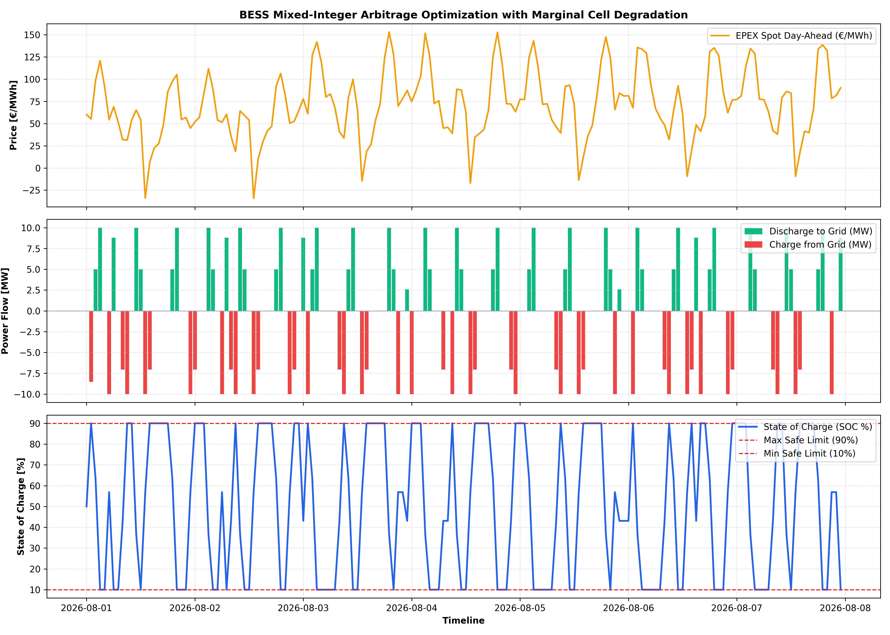

# 🔋 BESS Arbitrage & Battery Degradation Optimization Engine

> **Mathematical optimization framework (Linear Programming via HiGHS) for utility-scale Battery Energy Storage Systems (BESS) co-optimizing EPEX Spot Day-Ahead price spreads against marginal cell degradation and cycle aging.**

[](https://www.python.org/downloads/)
[](https://docs.scipy.org/doc/scipy/reference/optimize.linprog-highs.html)
[](https://opensource.org/licenses/MIT)
[](https://bess-arbitrage-degradation-engine-agp4qpxtz6sfwt24bafoxj.streamlit.app/)

---

## 📊 Dashboard Preview



---

## 📈 System Architecture & Optimization Flow

```mermaid
flowchart TD
    subgraph Market_Layer [Market Price Ingestion]
        A[EPEX Spot Day-Ahead Curve] --> B[Negative Price Detection]
        B --> C[Price Spread Vector c_t]
    end

    subgraph Degradation_Layer [Cell Physics & Aging Model]
        D[Battery CAPEX €/MWh] --> F[Marginal Cell Degradation €/MWh]
        E[Cycle Life @ 80% DOD] --> F
        F --> G[Degradation Cost Penalty]
    end

    subgraph Optimization_Engine [HiGHS Linear Programming Solver]
        C --> H{Objective Function Minimization}
        G --> H
        I[Physical Power Rating Bounds P_max] --> H
        J[State of Charge Limits SOC_min / SOC_max] --> H
        K[Round-Trip Efficiency Loss eta_rt] --> H
    end

    subgraph Output_Layer [Analytics & Dispatch Schedule]
        H --> L[Optimal Charge / Discharge Schedule]
        H --> M[Dynamic State of Charge Profile]
        H --> N[Gross Spread P&L vs Net Profit]
        H --> O[Equivalent Full Cycles EFC]
    end
